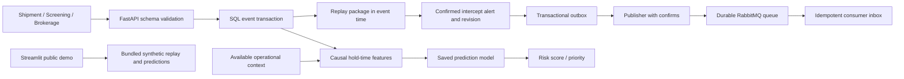

# Architecture and operational semantics

## Event-time rules

Screening and brokerage have independent active stop states. A release only clears its own source. SCAN or DELIVERY while either source has an active stop generates one incident per stop event. Additional movement in that episode does not generate repeated alerts. A new HOLD/REJECT from the same source supersedes that source's active stop. Event ties process CREATED, RELEASE, stop, then movement; a same-time stop applies before movement. All API timestamps are normalized to UTC. The API requires timezone-aware timestamps.

Events are immutable by event ID. Same ID and same normalized content is a duplicate; same ID and changed content is a conflict. Late events cause full recomputation for the package. A late release that predates an alleged violation retracts the earlier alert and emits a retraction revision. A release after actual violating movement does not erase the historical violation. Earlier late movement can update the incident's first movement reference. The API records each change in its outbox. Detection timestamp is movement event time, not wall-clock processing latency.

## Delivery guarantees

Events, alert changes and outbox rows commit together. The publisher marks sent only after successful broker confirmation; failures remain pending. Persistent messages plus a durable queue protect normal broker restart behavior. Publishing is **at least once**: a crash after broker acceptance but before database commit can duplicate a message. Stable message IDs and consumer inbox deduplication handle repeats. Consumer acknowledges after its database commit. Malformed messages go to a dead-letter queue; storage failures are requeued.

PostgreSQL advisory transaction locks serialize package recomputation across API processes. SQLite uses an in-process lock and is intended for a single API process; multi-process SQLite concurrency is not validated. The publisher preserves revision ordering and uses PostgreSQL row locks. Run one consumer in this prototype. The inbox stores revisions; it does not create an external notification or automatic intervention. Production needs reconnection/backoff policies, migrations, observability, access controls and operational ownership.

## Security and scope

Local API binds loopback in documented commands; Docker exposes only loopback API/management ports. Secrets are generated in ignored `.env`, never committed. API has no authentication and is unsuitable for public exposure. CSV demo runs without API/broker connections, processes in memory and accepts only synthetic/nonconfidential inputs. Joblib artifact must be trusted. No live carrier systems or actual control-center messages are used. UI is a public educational demo, not a persistent control-center dashboard.
